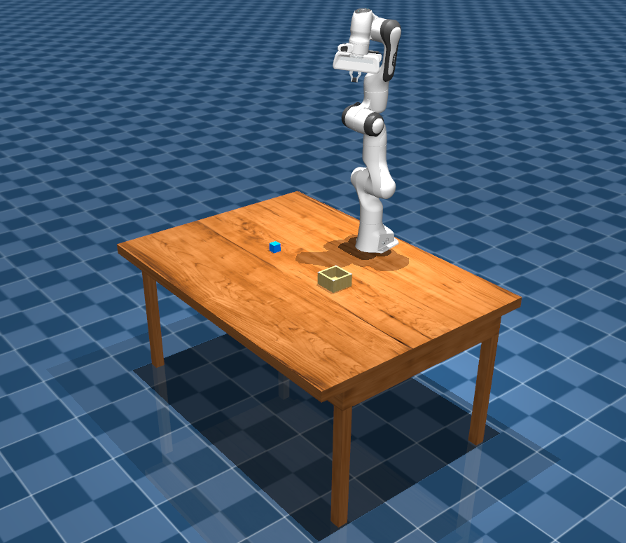

# Task 1: Create a Custom Simulation Task in MuJoCo

In this task, you will create a custom simulation scene for the MuJoCo physics engine using MJCF (MuJoCo XML) files. Your goal is to **compose a tabletop environment** featuring the **Arctos robot arm**, a **cube**, and a **bin**. The cube should be placed within reach of the robot arm, and the bin should be positioned such that it could be used as the target for a pick-and-place task. You do not need to implement any control or solve the task—this exercise focuses solely on scene composition.

    

You’ll be working with pre-existing MJCF object definitions, but feel free to explore or add your own to customize the environment. We’ve provided an XML file to construct the scene, which already includes a table asset as a starting point.

By the end of this task, you should feel comfortable with how MuJoCo scenes are structured, how to work with MJCF elements, and how to reason about object placement using coordinate frames and object geometry.

>You can find the necessary MJCF files for the arm and the provided objects [here](../assets).